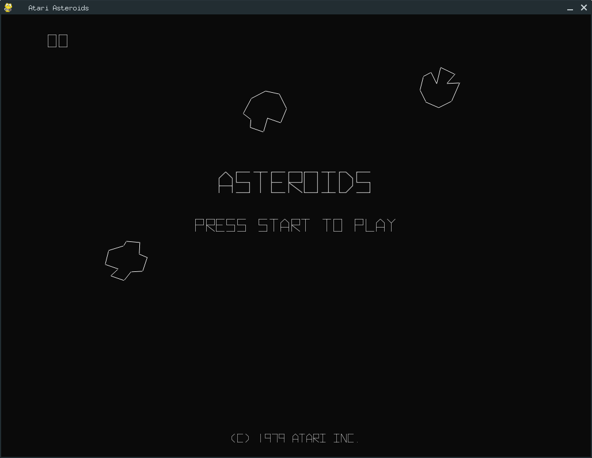
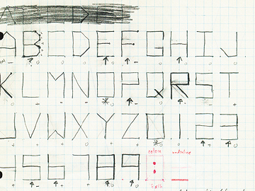

# Atari Asteroids

A Python / Pygame clone of the classic
Atari Asteroids arcade game of 1978. Turn down the lights, turn up the volume and travel back to 1978!

> Ported to Python 3 by Francisco Sanchez Arroyo. Based on the original work *Pythentic Asteroids* by Nick Redshaw

## Play
`python asteroids.py`   
or   
`python3 asteroids.py`

## Keys
* `Z` `X` or `Cursor Left Right` rotate
* `N` or `Cursor Up` thrust
* `B` or `Space` fire
* `H` hyperspace 
* `Enter` start 
* `P` pause 
* `O` frame advance whilst paused 
* `F` toggle full screen moode 
* `J` toggle show FPS

## Features 
* Intersecting line geometry used for collision detection. If a bounding box collision occurs between the 
ship and a rock extra checks are made using the code in the geometry.py to determine if any of the line segments intersect.
* Authentic asteroids shapes 
* Damped ship handling 
* Small and large saucers 
* Full screen 
* Fading explosion debris 
* Engine thrust jet 
* Extra life at 10,000 
* Hyperspace 
* Realistic fonts

All the code is Open Source GPL 

## The Making of: Asteroids

> This is a remastered version of an article that originally appeared in [E117](https://web.archive.org/web/20140104211104/http://www.edge-online.com/features/making-asteroids/)

* Format: Arcade
* Release: 1979
* Publisher: Atari
* Developer: In-house

When Atari released Asteroids in 1979, the game did something that very few coin-operated arcade games had ever done before. It kept selling. Months after its introduction, when the sales cycle for an arcade game should have ended, its manufacturer kept receiving orders.

More than 70,000 units were sold, generating revenues of US$150 million for Atari, and no one knows for sure how many coins the rock-splitting diversion sucked up, but Atari estimates it made more than US$500 million. Although orders have tapered off, the game’s legacy lives on with innumerable arcade, home and web-based adaptations. This obsession, over a quarter of a century old, owes its success to Atari programmer Ed Logg and a game that never took off.

With the success of Super Breakout, Logg had established himself as a Super Duper Game Guy (it’s the title on his current business card). Lyle Rains, the director of Atari’s coin-op group, needed Logg’s advice. The company was testing a game that featured a giant asteroid which couldn’t be destroyed. Yet that didn’t deter players. They kept shooting at the rock. According to Logg, “(Rains) felt that if people kept shooting at it maybe they really want to blow up asteroids. He said, *Well, why don’t we have a game where you shoot the rocks and blow them up?*”

However, Logg was looking for a little more strategy. He responded to Rains’ suggestion: “I’d really like to shoot the rocks and break them into smaller pieces because that way the player wouldn’t shoot everything, he would selectively pick. He doesn’t want to just randomly shoot because then you would have too many rocks flying around and it would be too damn dangerous.”

Logg knew that shooting rocks wouldn’t be enough: “You needed to do something, otherwise the player would just fly around and leave one rock on the screen and there’s no impetus to get you moving.” Having seen flying saucers in the game Spacewar!, Logg suggested that they introduce a similar flying saucer to chase the player on to the next round.

The next consideration was the graphics format. “(Rains) wanted it on raster and I suggested XY monitor because it’s higher resolution (1,024 x 760 versus raster’s 320 x 240) and you need that resolution to see what angle you’re shooting at. I was familiar with Spacewar!, the original vector game, and so I knew that the high resolution was required.” Since Logg was on a streak with great ideas, Rains gave him the green light on XY monitor and everything else. Logg was dubbed Asteroids’ programmer, project leader and artist. Also present in that first meeting was Howie Delman, who joined as engineer, and then Paul Mancuso joined the team as the game’s technician.

  
**Logg created his own font using the game's vector graphics, and made sure profane combinations of letters couldn't be used on the hi-score table**

Although developing coin-op games in the '70s was a laborious process, thanks to the complexity of the 6502 CPU, programming Asteroids was surprisingly pain free. The basic underlying routines for the existing XY hardware had already been used in Atari’s Lunar Lander.

One game element that evolved after the initial Asteroids meeting was the division of the big saucer and the small saucer. Logg wanted two saucers with different roles, “The big saucer would come in: *Shoot me, shoot me… I’m just going to take a few random shots... I’m cannon fodder*.” The small saucer would arrive after three big saucers. Its firing would be more focused than that of the big saucer. Throughout gameplay, the two would randomly switch appearances. Attain a certain score and you’d only see the small saucer. “Once your score got higher and higher the saucer would come in and shoot faster and faster and faster and faster until you reached some maximum limit,” says Logg, “[Reach that limit and] the spaceship is probably coming in as fast as he can, he’s shooting as fast he can and there’s an angle range that he shoots you at and it slowly decreases until he is extremely accurate.” Asteroids maxes out in complexity somewhere between 40,000 and 60,000 points. Logg has reached that range and beyond. He’s taken the machine to 99,999 points.

After only two years of programming games, Logg had already witnessed patterns within Atari that hinted at a game’s impending success. “I could tell when late in the project people would come in and bug you: *Can I play the game now? Can I play the game now?* Or you’d leave for the night, come back and the hi-score table would be full.” While all were good indicators, accolades from fellow engineers are rarely good predictors of market performance. The game needed real-world testing, which it got in Sacramento, California. Logg describes the first time he saw a normal person play his game, “First guy just walked up to the game, put a quarter in and died instantly. It must have been a 15-second game. And he turned around and put another quarter in. And for me that was like, *Okay, I know now that this game is okay*. Usually when people die after 15 seconds they say, *Oh shit, the game’s too hard*, and walk away. But in this case, it was clear to me that the player said, *I screwed up, I can do better.* And that’s what you want to see in a game.”

“The initial game design was set up so that as soon as the saucer came in he would take a shot,” says Logg. “And most people would hear the saucer sound first, and try to locate him. By this time of course the saucer has already taken a shot and if you weren’t paying attention or unlucky he could nail you before you even had a chance to do anything. So it was felt, and I agreed, that the saucer had to wait a little while before he took a shot at you. This opened the doors to the whole lurking strategy.” Logg wasn’t too concerned, since he tried to master lurking and was unsuccessful, so he felt nobody could do it. But that ‘delay before firing’ did result in the development of lurking, and Logg finally figured out how to do it himself.

Players used lurking to impress their friends. Operators started to complain about lost revenue. In response, Logg and his team created a new ‘lurk-limiting’ EPROM (Erasable Programmable Read-Only Module) to replace the old one. Asteroids fans soon realised that some machines were harder than others. If they came upon a machine with the new lurking-disabled EPROM, they’d move on to another machine. Experts wanted to lurk and show off. Others wanted to imitate the masters and learn how to lurk. No one knows for sure, but lurking may have been the factor that kept the game in play for such a long time.

Get good enough at Asteroids and the game slows down; Logg had no idea that players were going to cap his resources. It’s a programming error that Logg admits to, “I should have limited the number of the player spaceships to ten or something. But I drew so many across the top of the screen and I kept drawing them off the edge of the screen that the game actually slowed down.” Build 50 to 100 lives and the game will begin to crawl.

Collect more than 250 lives and you may lose your game. It’s the fault of the machine’s watchdog circuit. To stay operational, coin-operated arcade units need a periodic response from the program. The watchdog circuit tells the machine that the game is still working. If too much time passes and the program doesn’t receive a response,  the watchdog circuit will think the game’s dead and it will reboot.

Logg definitely yearns for the earlier days of game developing, where he only dealt with one or two people instead of 30 and it only took a few weeks instead of a year and a half to develop a prototype. Asteroids has been a major part of his life. He used to play the game in his sleep. When he mentions it to people, he often gets the response, “Oh, so you’re responsible for all my lost milk money.” Logg, however, doesn’t accept responsibility. That’s not to say he wouldn’t give Asteroids credit for his marriage: in an odd twist, before he ever met his wife, she already owned a coin-op Asteroids in her home.
